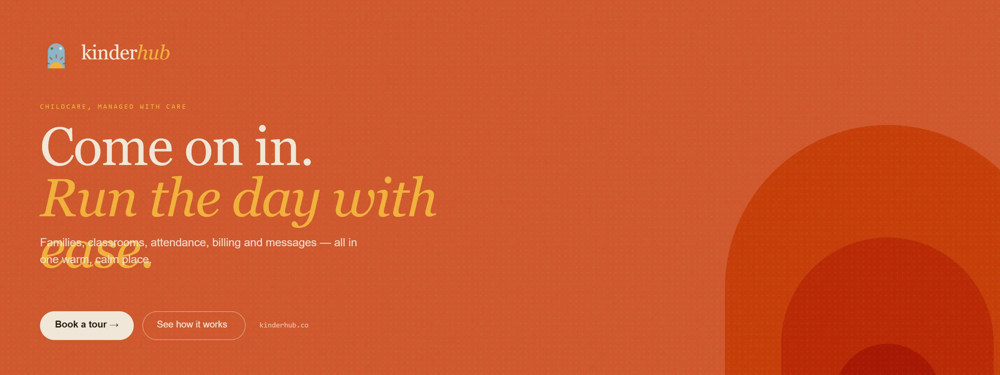
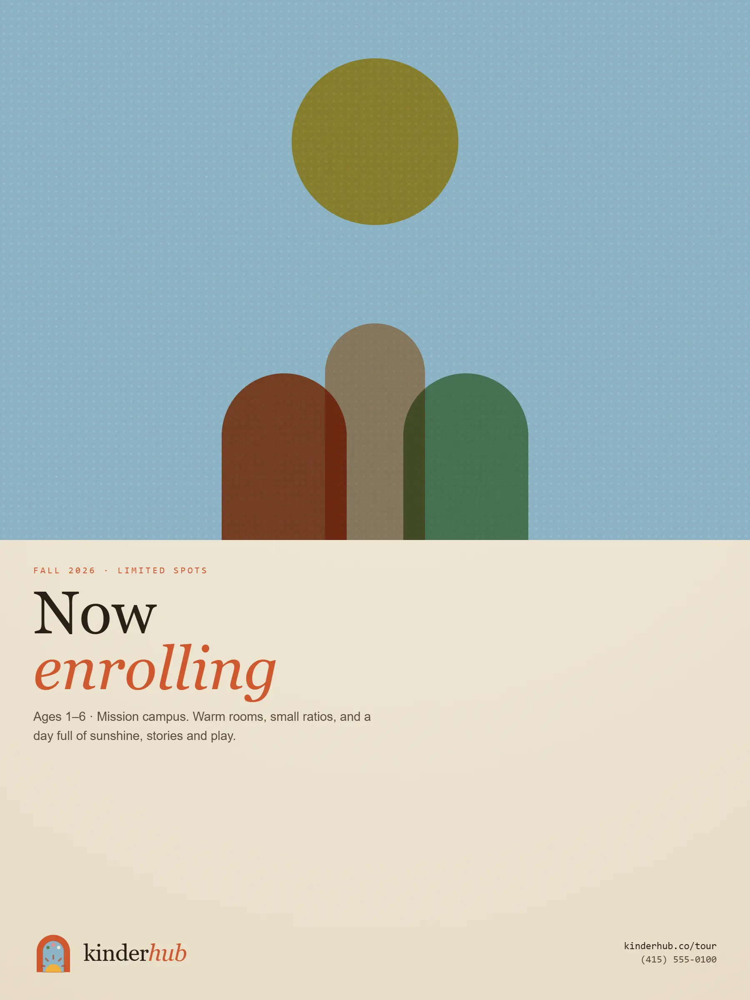
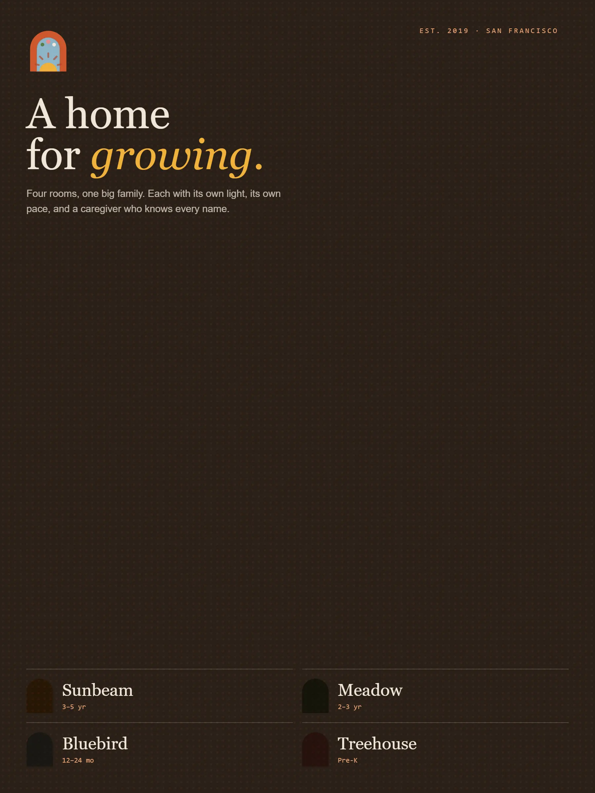
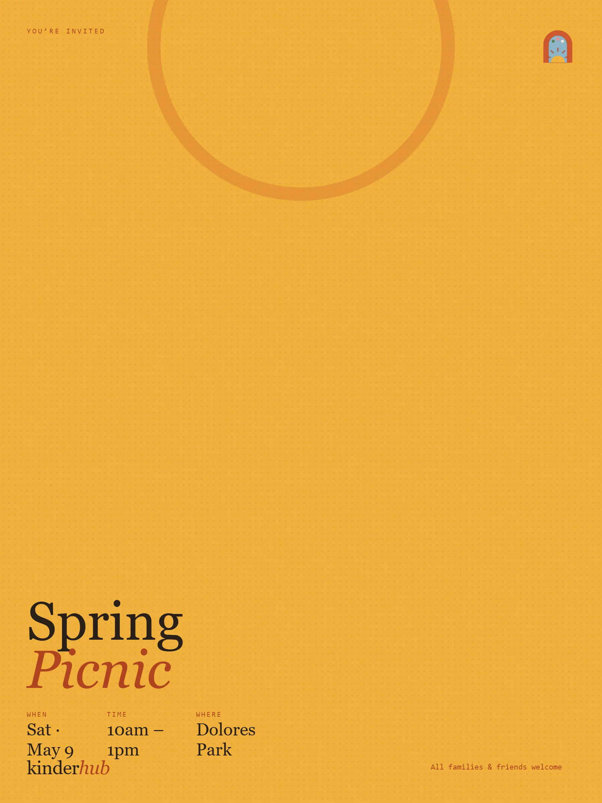
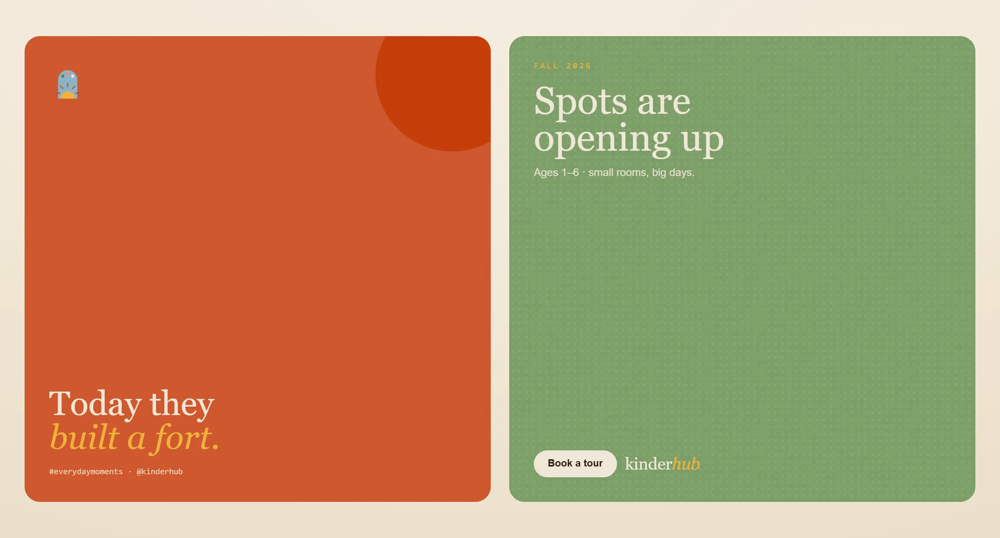
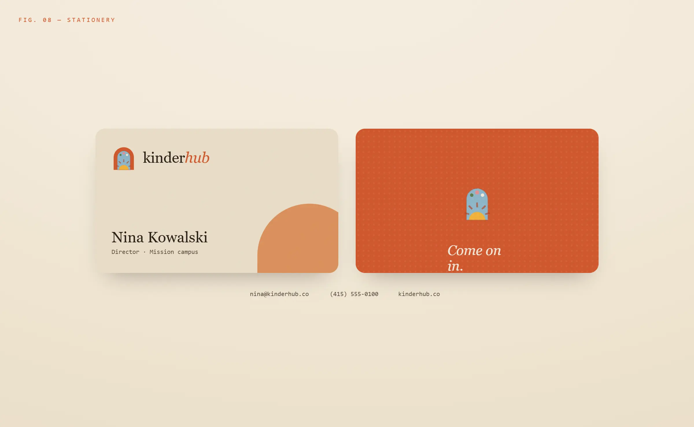
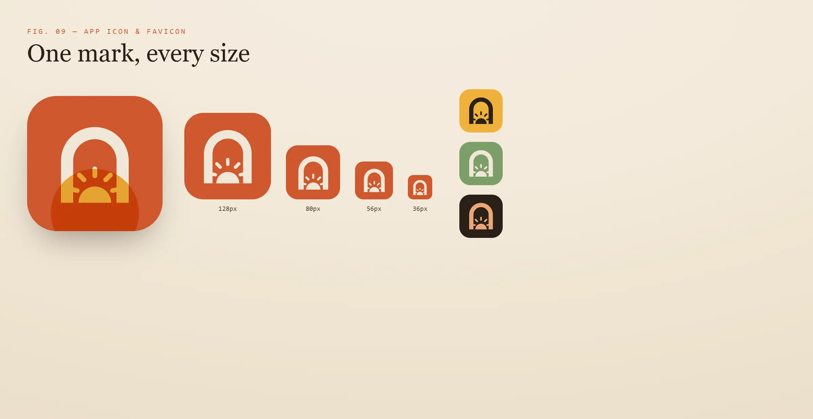
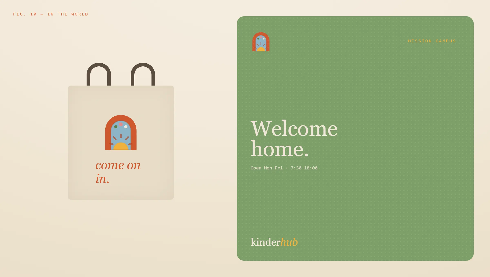

<div align="center">



# kinder*hub*

**The quiet, capable CRM behind every great childcare program.**  
Families, attendance, billing and messages — all in one place.

[](https://nextjs.org)
[](https://www.typescriptlang.org)
[](https://supabase.com)

</div>

---

## What it is

Kinderhub is a multi-tenant CRM dashboard built for childcare directors and staff. It handles the operational side of running a program — family records, staff management, class scheduling, billing, and document storage — wrapped in a warm, considered design system built from the ground up.

---

## Brand

<table>
<tr>
<td width="50%">



</td>
<td width="50%">



</td>
</tr>
<tr>
<td width="50%">



</td>
<td width="50%">



</td>
</tr>
</table>

<table>
<tr>
<td width="50%">



</td>
<td width="50%">



</td>
</tr>
</table>



---

## Stack

| Layer | Technology |
|-------|-----------|
| Framework | Next.js (App Router, server components) |
| Language | TypeScript |
| Styling | Tailwind CSS v4 + custom `kh-*` design system |
| Database | Supabase (PostgreSQL) |
| Auth | Custom JWT via Web Crypto API (HMAC-SHA256) |
| Storage | Supabase Storage — private bucket, signed URLs |
| Validation | Zod |

---

## Getting started

```bash
npm install
npm run dev
```

Open [http://localhost:3000](http://localhost:3000)

### Environment variables

```env
NEXT_PUBLIC_SUPABASE_URL=...
SUPABASE_SERVICE_ROLE_KEY=...
JWT_SECRET=...
```

---

## Project structure

```
app/
├── dashboard/
│   ├── staff/[id]        Employee detail — tabs, documents, work history
│   ├── families/[id]     Family detail — children, parents, billing
│   ├── classes/          Class scheduling
│   ├── billing/          Invoices and revenue
│   └── settings/         Departments, roles, team
├── api/
│   ├── modules/          Service / Repository / Validation / Types per entity
│   └── ...               Route handlers (auth, users, families, parents, kids…)
components/
└── ui/                   Modal system, AddStaffModal, AddFamilyModal, DataTable…
lib/
└── auth.ts               JWT sign / verify / cookie helpers
```

See [`PROJECT_OVERVIEW.md`](PROJECT_OVERVIEW.md) for the full architecture reference.

---

<div align="center">

*Four rooms. One big family. Each with its own light, its own pace,*  
*and a caregiver who knows every name.*

**kinderhub.co**

</div>
